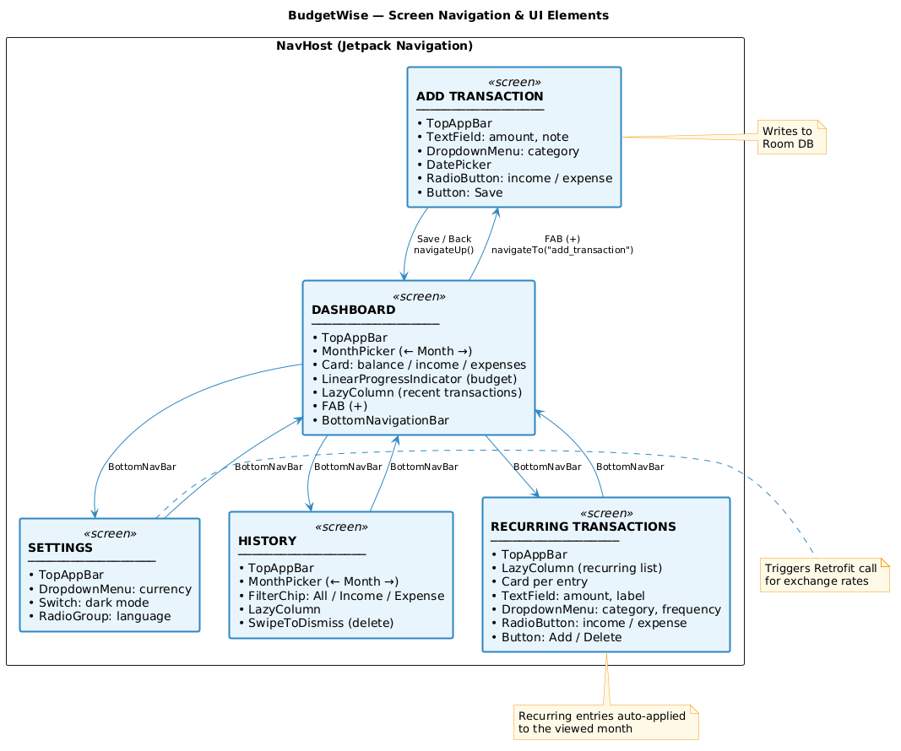
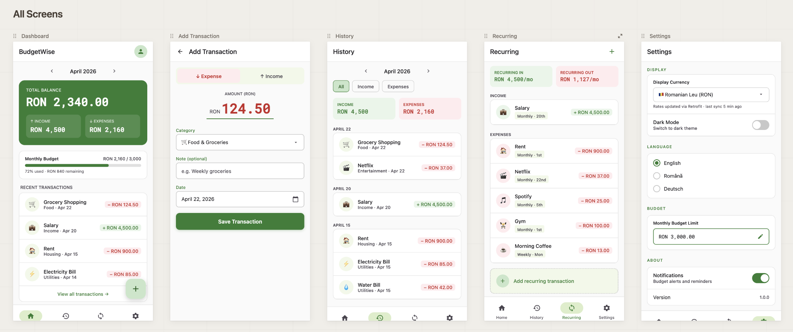

# 💰 BudgetWise — Android Budget Tracking App
### Android Course — Intermediate Project Presentation (IPP)

---

## 📌 Project Idea

**BudgetWise** is a personal finance tracking application for Android, built with Kotlin and Jetpack Compose. It allows users to log income and expense transactions, organize them by category, and get a live overview of their financial balance. Exchange rates are fetched from a public REST API, so users can view their balance in a currency of their choice.

---

## 🎯 Main Functionalities

| # | Feature | Details |
|---|---------|---------|
| 1 | **Add Transactions** | Log income or expense entries with amount, category, date and optional note |
| 2 | **Transaction History** | Scrollable list of all transactions, filterable by type (income / expense) and by month |
| 3 | **Dashboard Overview** | Summary card showing balance, income, expenses and set budget **for the selected month** |
| 4 | **Month Picker** | Arrow-based or dropdown month selector available on both Dashboard and History screens |
| 5 | **Monthly Budget** | Users can set a spending budget for the current month; a progress bar shows how much has been used |
| 6 | **Recurring Transactions** | Dedicated screen to define recurring income or expenses (e.g. salary, rent) with frequency (daily / weekly / monthly) |
| 7 | **Category Management** | Predefined categories (Food, Rent, Salary, etc.) shown with colored labels |
| 8 | **Currency Conversion** | Fetches live exchange rates via REST API (e.g. [exchangerate.host](https://exchangerate.host)) and displays balance in the selected currency |
| 9 | **Settings Screen** *(bonus)* | Choose preferred display currency, toggle dark/light theme, select language |
| 10 | **Local Database** *(bonus)* | Transactions are persisted locally using Room (SQLite) with input sanitization |

---

## 🗺️ Screens, Navigation Flow & UI Elements



### Screen Previews



### Interactive Mockup

Serve this folder locally:

```bash
npx serve .
```

Then visit `http://localhost:3000`.

---

*BudgetWise — Android Course Project · April 2026*
